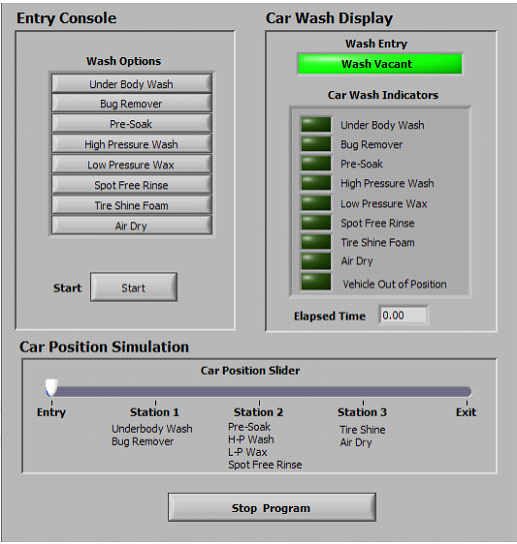

# CSharp-CarWashApp

This is a project that I created for one of my clients recently. It's my very first winform application and also first time using another thread to do some background tasks. I learnt a lot about UI elements, events, multi-thread etc. while working on this one.

I'm adding requirement file:

# Application Requirements

## Objective

Design a car wash controller using with the software language you are familiar.  The front panel of the simulator will be resemble the following below (Figure 1). 

## General Operation

The car wash controller simulates the control system of an automated car wash. The user
interacts with controls and indicators on the front panel to select the car wash options and
simulate the travel of the vehicle in the car wash.

The controller should perform the following general operations:

⦁	Indicate on the Wash Entry LED if the car wash is vacant or a wash is in progress.
⦁	Allow the user to select Wash Options.
⦁	Start the washing process when the user clicks Start.
⦁	Indicate the current wash step on the Car Wash Indicators LEDs and display the Elapsed Time on the indicator.
⦁	Turn ON the Vehicle Out of Position LED and pause the elapsing time if the vehicle
moves from the designated position during a cycle.

## Sequence of Operation
**Start (Application Run)**: When the application starts, the front panel controls and
indicators should be in the following states:

⦁	Entry Console: All controls should be enabled.
⦁	Car Wash Display: The Wash Entry LED should be green and display Wash
Vacant. All Car Wash Indicators should be turned OFF and the Elapsed
Time indicator should display 0.00.
⦁	Car Position Simulation: The Car Position Slider should be at the Entry
position.

Select Wash Options: Click the Wash Options buttons to select the washing steps. The
buttons should remain clicked until the completion of the wash cycles.

Start: Click the Start button to begin the car wash process. This should configure the
controller to execute the steps selected by the Wash Options buttons.

Note The High Pressure Wash step is the default wash. If the user did not select High
Pressure Wash, or if the user did not select any options, High Pressure Wash must be
added to the options programmatically after the use clicks Start.

⦁	The controller should disable the Wash Options buttons.
⦁	The controller should signal the start of the wash by changing the color of the Wash
⦁	Entry LED to red and displaying Wash In Progress.
⦁	The controller should check if the vehicle is at the appropriate station for the first step in.
⦁	the selected wash type by monitoring the Car Position Slider.

Note Refer to the Car Wash Step Timing and Station Positions table at end of the
specification for a list of stations that correspond to the car wash steps.

If the vehicle is not at the appropriate station, the controller should turn ON the Vehicle
Out of Position LED and not begin timing.

If the vehicle is at the appropriate station, the appropriate wash step LED should turn ON
and the Elapsed Time indicator should count up from zero to indicate elapsed time for
that step.

Upon completion of a step, the Elapsed Time indicator should reset to zero.
Each wash step should not last for more than the time allocated in the Car Wash Step
Timing and Station Positions table at the end of the specification.

Upon completion of a step, if the vehicle is in the appropriate station, the controller
should continue to the next wash step by resetting and restarting the elapsed timer.
Upon completion of a step, if the vehicle is not in the appropriate station, the controller
should turn ON the Vehicle Out of Position LED and not begin timing.

If the vehicle moves away from the wash station in the middle of a wash step, the elapsed
time should pause, the Vehicle Out of Position LED should turn ON and the appropriate
wash step LED should turn OFF. When the vehicle position is restored to the correct
position by moving the Car Position Slider, the Vehicle Out of Position LED should
turn OFF, the appropriate wash step LED should turn ON, and timing should continue
from the paused time until completion of the step.

When all the wash steps are complete, the Vehicle Out of Position LED should turn ON,
indicating to the user to exit the car wash. When the user moves the Car Position Slider
to the Exit position, all Car Wash Indicators should turn OFF and the Car Position
Slider should reset to the Entry position. The Wash Entry indicator should turn green
and display Wash Vacant, and the controls in the Wash Entry Console should be
enabled to allow the user to select and start another car wash process.

Stop Program: Click Stop Program to abort the car wash process at any time and stop
the application. When the application stops, the front panel controls and indicators should
be in the following states:

⦁	Entry Console: All controls should be enabled.
⦁	Car Wash Display: The Wash Entry LED should be green and display Wash Vacant,
all Car Wash Indicators should be turned OFF, and the Elapsed Time indicator should
reset to zero.
⦁	Car Position Simulation: The Car Position Slider should reset to the Entry position.

## Car Wash Step Timing and Station Positions:

| Wash Steps         | Step Time | Station   |
|--------------------|-----------|-----------|
| Under Body Wash    | 5 seconds | Station 1 |
| Bug Remover        | 5 seconds | Station 1 |
| Pre-Soak           | 5 seconds | Station 2 |
| High Pressure Wash | 5 seconds | Station 2 |
| Low Pressure Wax   | 5 seconds | Station 2 |
| Spot Free Rinse    | 5 seconds | Station 2 |
| Tire Shine Foam    | 5 seconds | Station 3 |
| Air Dry            | 5 seconds | Station 3 |
